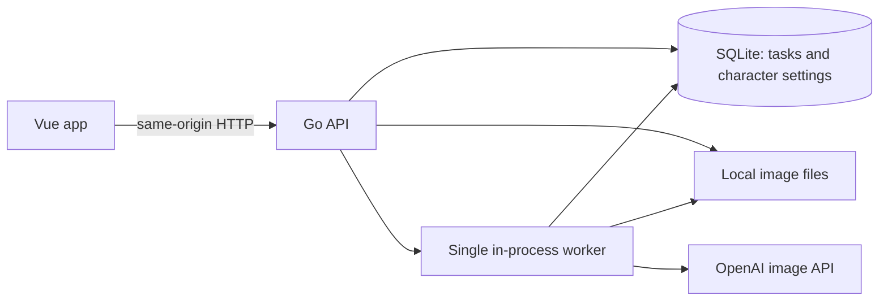

# Personal To-Do MVP

**Status:** MVP implementation in progress.

## Product scope

A single-household to-do app. The user creates and manages manual tasks. Completing a task immediately saves it as completed and queues one surprise image generation featuring the canonical character doing or celebrating that task.

The task list is the main screen. A newly completed task opens a reward view: while work is pending, show **“Your reward is being prepared”**; when the image is ready, reveal it prominently. Keep a thumbnail on the completed task afterward. Show a clear failed state if generation fails, with a user-initiated retry.

The minimal settings screen edits the character prompt, style prompt, and reference images. There is one global character definition and exactly one reference marked canonical; additional reference images may be kept alongside it. There is no character or prompt version history.

### Reusable reference material

This project is being created from scratch; the linked repository was inspected as reference material only. The reference app provides useful starting patterns for Go task models and HTTP handlers, and Vue task creation, listing, and completion flows. Its CSV persistence should be replaced by SQLite. Its recurring-task templates and separate template refresh job are outside this MVP.

## Architecture

- **Backend:** Go HTTP API and one serial, in-process background worker.
- **Frontend:** Vue app served by the Go service on the same origin in deployment. The browser only talks to the backend.
- **Database:** SQLite stores tasks, reward state, character prompts, and image paths. A queued task row is the durable work queue; no separate queue service or jobs table is needed.
- **Images:** Store uploaded references and generated rewards on the Pi's local filesystem. Store relative paths in SQLite and serve image files through backend routes. Write generated files to a temporary path and rename them into place before marking a reward ready.
- **Secrets and network:** Keep the OpenAI API key in backend environment/configuration only. Do not return it from settings APIs or bundle it into Vue. Run on the household LAN, with no public hosting or router port forwarding. The MVP assumes a trusted household network and does not add accounts.
- **Runtime data:** Keep the SQLite database and image directory together under a configurable persistent data directory so they can be backed up as one set.

## Data model

### `tasks`

- `id` — primary key
- `title` — required task text
- `description` — optional details
- `created_at` — creation timestamp
- `completed_at` — nullable; its presence records completion
- `reward_status` — `none`, `queued`, `generating`, `ready`, or `failed`
- `reward_image_path` — nullable local path, populated only when ready
- `reward_error` — nullable concise error for the failed state

Open tasks have reward state `none`. Completing a task changes `completed_at` and `reward_status` to `queued` in one SQLite transaction. Completed tasks stay completed if generation fails. Completing the same task again is idempotent and must not queue another image. Open tasks can be edited or deleted; completed tasks cannot be changed or deleted, and are not reopened in this MVP.

### `character_settings`

One singleton row (`id = 1`) containing separate prompts for appearance, clothing, home, companion, personality, and art style, plus `updated_at`. Existing `character_prompt` and `style_prompt` values migrate to appearance and art style respectively.

### `character_reference_images`

- `id` — primary key
- `image_path` — local path
- `is_canonical` — identifies the single canonical reference
- `created_at` — upload timestamp

The settings UI can replace the canonical image and manage optional additional references. There must always be one canonical reference before generation is enabled. The worker reads the current saved character settings when it starts a queued task; no prompt/reference snapshot or version history is kept.

## Completion and reward flow

1. The user creates a manual task. It is saved as open with reward state `none`.
2. The user completes it. The API commits the completion timestamp and `queued` reward state together, then returns the updated task without waiting for image generation.
3. The single worker claims a queued task by changing it to `generating` in SQLite, builds an image request from the task text plus the current appearance, clothing, home, companion, personality, art style, and reference images, and calls OpenAI using the backend-only key.
4. On success, the worker saves the image to local storage and changes the task to `ready` with its image path. The frontend polls task state and reveals the image prominently; the completed task card keeps a thumbnail.
5. On failure, the worker records `failed` and a concise error. There are no automatic generation retries. The user can explicitly retry from the reward view, which returns that completed task to `queued`.

Queued rows survive restarts and are picked up on worker startup. A row left `generating` by a process crash is changed to `failed` at startup and requires an explicit retry. If OpenAI accepted a request before the crash but the result was not saved, an explicit retry could incur a second charge; the MVP cannot guarantee exactly-once behavior across that boundary. There is no automatic retry of ambiguous requests.

## Smallest implementation plan

1. Create a fresh Go backend and Vue frontend in this repository, with a small same-origin deployment setup and configurable persistent data directory.
2. Add SQLite schema/access for tasks and singleton character settings. Implement the manual task API and atomic completion-plus-queue transition.
3. Add the single worker, OpenAI image request, local file storage, reward state updates, startup recovery, and explicit retry endpoint.
4. Build the task list/create/edit/delete UI, completion reward state and prominent reveal, completed-task thumbnails, and minimal character settings/reference-image UI.
5. Package it for the Raspberry Pi as one service, configure the backend-only API key, and document LAN-only operation and backup paths.

## Explicit non-goals

- AWS, public hosting, or access from outside the household network
- Multiple users, accounts, or multiple character definitions
- Recurring tasks, task templates, or scheduled task generation
- Image generation before completion or reward pre-generation
- Redis, SQS, Kafka, Kubernetes, or distributed workers
- Galleries, style marketplaces, cost dashboards, notifications, or generalized SaaS features
- Character or prompt version history
